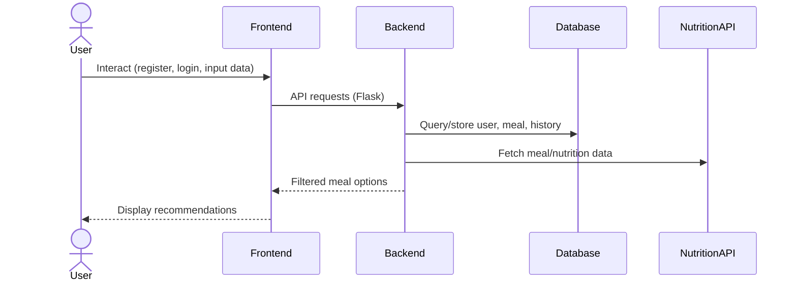
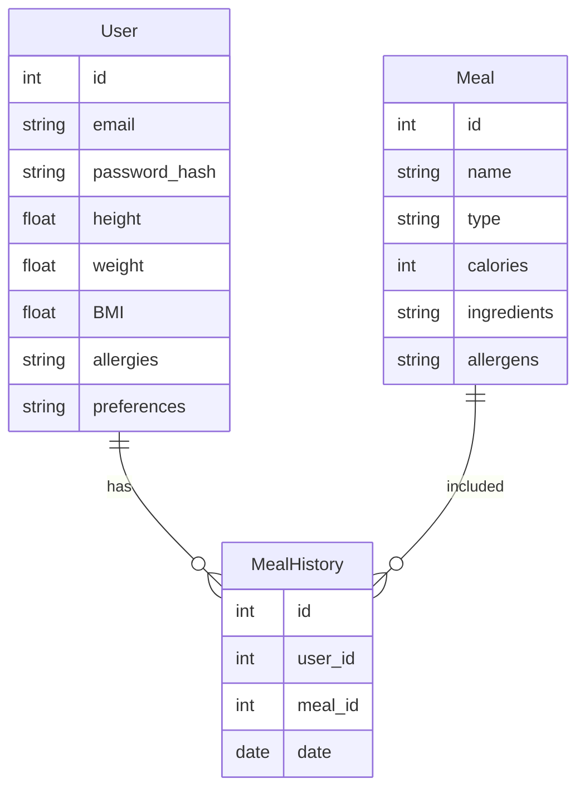
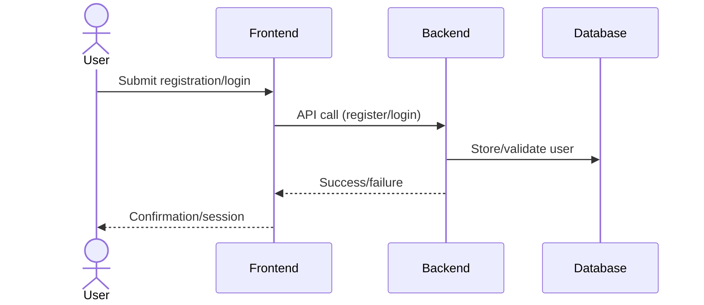
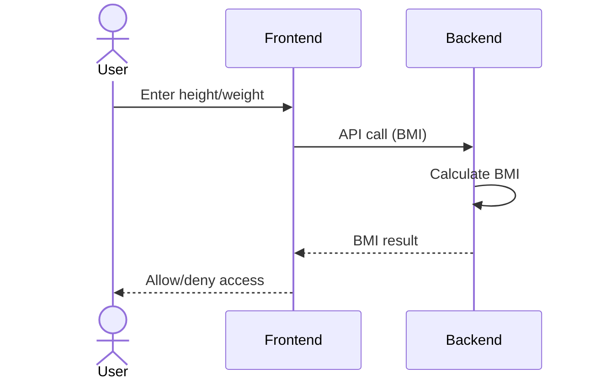
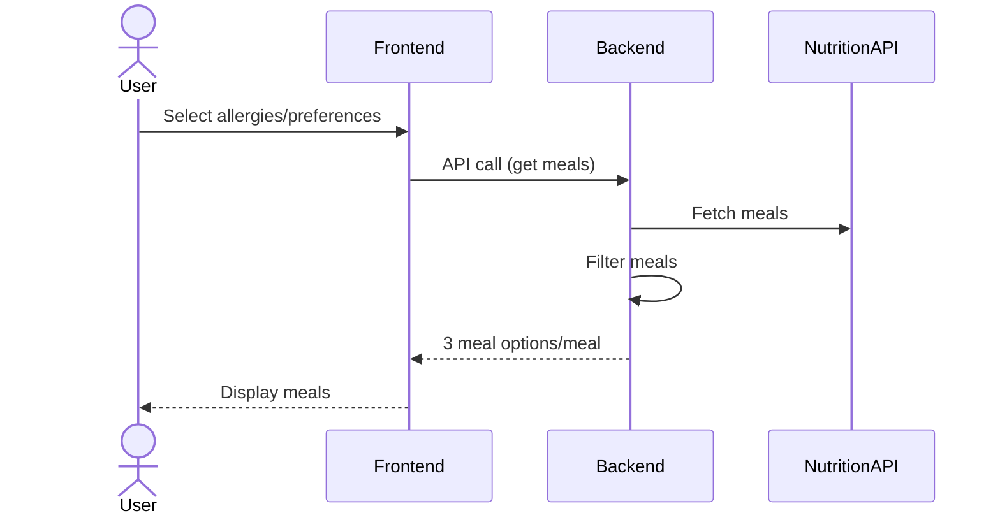

# Technical Documentation

## Authentication & Registration
- Registration requires: first_name, last_name, email, password, height, weight.
- Passwords hashed using Werkzeug.
- Error handling: return JSON { error: string, details?: object } with proper HTTP status.
- Password reset (future): configure SMTP via env; standard token flow.

## Database Schema
- users(id, first_name, last_name, email unique, password_hash, height, weight, BMI, allergies, preferences)
- meals(id, name, type(enum breakfast|lunch|dinner), calories, ingredients, allergens)
- meal_history(id, user_id fk, meal_id fk, date)
- Proposed: user_progress(id, user_id fk, weight, recorded_at)

## AI Meal Suggestion
- Excludes meals with user allergens (ingredients/allergens match, case-insensitive).
- If BMI ≥ 30, cap single-meal recommendations at ≤ 700 kcal.
- Scores meals by proximity to target calories based on BMI; boosts for user preferences.
- Data source: USDA FoodData Central (optional key via USDA_API_KEY) or vetted internal seed.

## API Responses
- Success: 2xx with JSON payload.
- Errors: 4xx/5xx with { error: string, details?: object }.
- /api/meals (POST): accepts { type?, max_calories?, specific_allergies? }.
- /api/profile (GET/PUT): fetch/update user fields.

## Ethical AI & Privacy
- Avoid harmful suggestions; respect allergies and medical constraints.
- Anonymize analytics; store only necessary PII.
- Provide opt-out for data collection; document retention policies.

## Validation Rules
- Height/weight must be positive numbers; prevent divide-by-zero in BMI.
- For users with BMI ≥ 30, recommended meal calories ≤ 700 kcal.

# Technical Documentation

## 1. User Stories and Mockups

### User Stories (MoSCoW Prioritization)
- Must Have:
  - As an obese adult (BMI ≥ 30), I want to register securely with email and password, so that my health data is protected.
  - As a user, I want to log in and recover my password via email, so that I can always access my account safely.
  - As a user, I want to enter my height and weight, so that the system calculates my BMI and verifies my eligibility.
  - As a user, I want to select my allergies and food preferences, so that meal recommendations exclude unsafe foods.
  - As a user, I want to receive three meal options for each meal (breakfast, lunch, dinner) that support safe weight loss, so that I can follow a medically guided plan.
- Should Have:
  - As a user, I want to view my meal history, so that I can track my progress.
- Could Have:
  - As a user, I want to update my weight periodically, so that recommendations stay relevant.
- Won't Have:
  - Integration with wearable devices, real-time chat with dietitians, grocery delivery, or predictive AI (for MVP).

### Mockups
- Registration/Login screen (email, password, forgot password)
- BMI input screen (height, weight)
- Allergy and preference selection screen (dropdowns)
- Meal recommendation screen (three options per meal)

---

## 2. System Architecture
### System Architecture Diagram

Web Application Architecture:
  - Front-end: React (or any modern framework)
  - Back-end: Python Flask
  - Database: PostgreSQL (or Firebase)
  - External API: Trusted nutrition database (USDA or Edamam)
Data Flow:
  - User interacts with the front-end (registration, login, data input)
  - Front-end sends requests to the Flask backend (authentication, BMI calculation, meal recommendations)
  - Flask backend queries the database and external nutrition API
  - Flask backend returns filtered meal options to the front-end

---

## 3. Components, Classes, and Database Design
### Entity Relationship Diagram (ERD)

### Backend Classes/Components
User: id, email, password_hash, height, weight, BMI, allergies, preferences
Meal: id, name, type (breakfast/lunch/dinner), calories, ingredients, allergens
MealHistory: id, user_id, meal_id, date

### Database Design (Relational)
Table: users (id, email, password_hash, height, weight, BMI, allergies, preferences)
Table: meals (id, name, type, calories, ingredients, allergens)
Table: meal_history (id, user_id, meal_id, date)

### Frontend Components
RegistrationForm
LoginForm
BMIInput
AllergyPreferenceSelector
MealRecommendationDisplay

---

## 4. Sequence Diagrams
### Registration & Login Sequence

### BMI Verification Sequence

### Meal Recommendation Sequence

User Registration & Login:
  1. User submits registration form → Backend validates & stores user → Confirmation sent
  2. User logs in → Backend authenticates → Session created
BMI Verification & Eligibility:
  1. User enters height/weight → Front-end calculates BMI → If BMI ≥ 30, user proceeds
Meal Recommendation:
  1. User selects allergies/preferences → Backend fetches meals from nutrition API → Filters meals → Returns three options per meal

---

## 5. API Specifications

### External APIs
Nutrition Database API (e.g., USDA or Edamam): Used to fetch meal data and nutritional information. Chosen for reliability and medical validation.

### Internal API Endpoints
| Endpoint                | Method | Input                        | Output         | Description                                 |
|-------------------------|--------|------------------------------|---------------|---------------------------------------------|
| /api/register           | POST   | email, password, height, weight | JSON (user)   | Register new user                           |
| /api/login              | POST   | email, password              | JSON (token)  | Authenticate user                           |
| /api/forgot-password    | POST   | email                        | JSON (status) | Send password reset email                   |
| /api/bmi                | POST   | height, weight               | JSON (BMI)    | Calculate BMI and check eligibility         |
| /api/preferences        | POST   | allergies, preferences        | JSON (status) | Save user preferences                       |
| /api/meals              | GET    | user_id                      | JSON (meals)  | Get three meal options per meal type        |
| /api/meal-history       | GET    | user_id                      | JSON (history)| Retrieve user's meal history                |

---

## 6. SCM and QA Plans

### Source Control Management (SCM)
Use Git for version control
Branching strategy: main (production), dev (integration), feature branches (per task)
Code reviews via Pull Requests before merging to dev/main

### Quality Assurance (QA)
Unit tests for authentication, BMI calculation, allergy filtering
Integration tests for API endpoints
Manual testing for user flows (registration, login, meal selection)
Tools: Jest (backend), Postman (API), Cypress (frontend)
Deployment pipeline: staging for QA, production for launch

---

## 7. Technical Justifications

Web-based MVP for accessibility and rapid deployment
PostgreSQL provides structured, secure, and scalable storage
External nutrition database ensures medical accuracy and reliability
Git workflow ensures code quality and traceability
Testing tools and deployment pipeline reduce risk and improve reliability

---